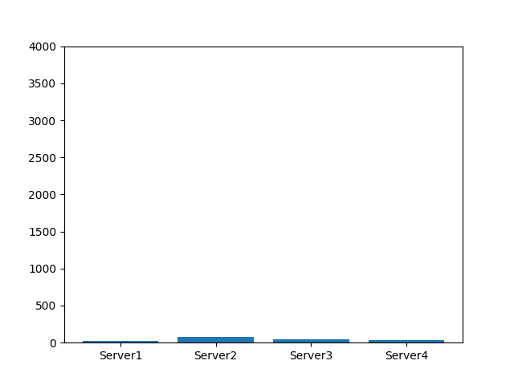

# Evaluation

Detailed step by step description of how to reproduce your evaluation results.

TODO: Reorganize directories and write some scripts to simplify the process of obtaining results.

## Experiment 1

In our first experiment we compare our NetCache switch to another switch program
that is only able to perform basic forwarding. For this we generate a random
zipf-distributed (and therefore skewed) sample of queries that we send to a set
of key-value stores. We evaluate the number of queries each server has to process
in order to show that our implementation of NetCache significantly reduces the
load of each server and improves on load-balancing.

We start our experiment by evaluating the number of queries that will be sent
to each key-value store when not using NetCache. Afterwards we follow the same
 approach but use our implementation of NetCache instead of a basic
 forwarding switch.
Note that we assume the following for each query throughout our experiment: We
assign each query to a specific key-value store that is supposed to answer this
query.

## Simple Forwarding Switch

### Generating a sample of queries
First, we generate a random, zipf-distributed sample of keys for which we will
send read queries to the key-value stores.

Go to the directory `src/kv_store` and run `python3 generate_zipf_sample.py`.
This will create the corresponding random sample under
 `src/kv_store/data/zipf_sample.txt`. Note that you can modify the following
 parameters directly in `generate_zipf_sample.py`: `NO_QUERIES` (number of
queries that will be sent), `MAX_KEY_VAL` (all keys will be drawn randomly from
the range [1,MAX_KEY_VAL]) and `ZIPF_PARAM` (parameter of the Zipf-distribution
affecting the skewness).

### Creating data for key-value store initialization
Next we create a set of key-value pairs that we will use to initialize our
key-value stores. From the directory `src/kv_store` call
`./produce_keyvals.sh -n <n_values> -s <n_servers>`. Here `n_values` denotes
the range for which we will generate all keys, i.e. we generate a key-value
pair for all keys in the range [1,n_values]. Thus `n_values` should be the same
value as `MAX_KEY_VAL` in the previous section to ensure that a key-value store
will be able to answer each query it receives. `n_servers` is the number of
key-value store instances we would like to run. In the context of this example
we will use four key-value store instances. The generated key-value pairs are
saved in files in `src/kv_store/data`.

### Starting the mininet topology
Now we are able to start our topology which will consist of:
  * a client sending the queries
  * a set of servers running a key-value store (4 in our example)
  * a simple forwarding switch connecting the client and servers

Change to the directory `src/p4` and call
`sudo p4run --config p4app_forwarding_4_1.json` to start the corresponding
topology. To populate the routing tables of the switch call
`python forwarding_controller.py` from `src/control_plane`.

We also have to initialize our key-value store instances (i.e. start them and
load the initial key-value pairs). To do this call `./init_servers.sh <n_servers>`
from `src/p4` (again `n_servers` denotes the number of key-value store instances,
which is 4 in our case).

### Send the set of sampled queries
We proceed by starting a terminal on the client: `mx client1`. Afterwards we change
to the directory `src/kv_store` and call `python3 zipf_read_test.py` which will
send all queries to the respective key-value stores. The output that is printed
on the command line represents the values that were obtained after each query was
answered. For simplicity the values are the same as the keys.

### Visualize the load of each key-value store
Finally, we generate a visual representation of the load that each key-value
store had after executing all queries. To do this change to `src/kv_store` and call
`python plot_queries.py <n_servers> <show/save> <yaxis_limit>`. Choose either
`show` or `save` depending on whether you want to save the plot as an image or not.
`yaxis_limit` sets limit on the y-axis (which might be helpful when comparing
these results to the results we will obtain later using NetCache). For example
call: `python plot_queries.py 4 show 4000`.

You may note that the plot shows an imbalance in the number of queries each
server received.

## NetCache
Now we conduct this experiment again but use NetCache instead of a simple forwarding
switch. A few steps we already performed in the first part of this experiment
don't have to be repeated.

### Starting the mininet topology
We start our new topology which will consist of:
* a client sending the queries
* a set of servers running a key-value store (4 in our example)
* a switch connecting the client and servers running our P4 NetCache implementation

Additionally the controller will not only populate forwarding tables but will
run for the entire duration of this experiment as it plays an important role
in the NetCache architecture.

We call `sudo p4run --config p4app_4_1.json` from `src/p4` to start the topology.
Additionally we start the controller from `src/control_plane` by calling
`sudo python controller.py`.

We also initialize the key-value store instances (the same way as in the first
example) with: `./init_servers.sh 4` from `src/p4`.

### Send the set of sampled queries
Again, we get a terminal on the client (`mx client1`) and send all queries by
calling `python3 zipf_read_test.py` from `src/kv_store`. Note that the
sample of queries is the same as in the first example. This allows us to perform
a reasonable comparison.

### Visualize the load of each key-value store
We create a plot of our results the same way as before (call
`python plot_queries.py 4 show 4000` from `src/kv_store`).

Now we can compare the results obtained using NetCache with the results we
got in the first run.
You might notice that the number of queries that each server received is
significantly lower when using NetCache. Also the load is better balanced,
i.e. we don't observe a server that experiences significantly more or less load
than the other servers.

### Exemplaric plots

The plots below show the results we obtained after running both
approaches on a random sample of queries. The sample consists
of 4000 random, zip-distributed (parameter 2.0) keys from the range
[1,2000].

Results obtained for switch without NetCache

Results obtained for switch with NetCache

