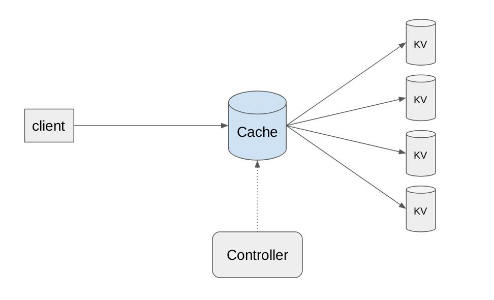
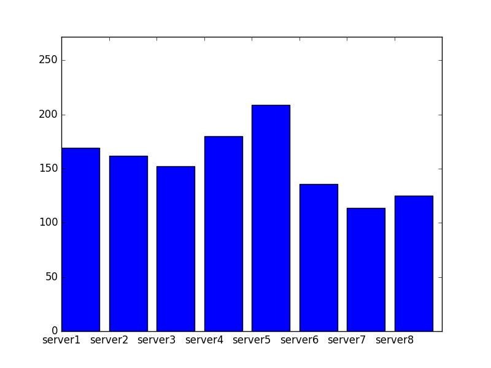
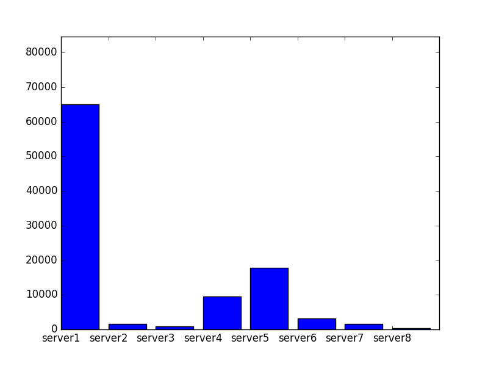

# Evaluation

Below we present evaluation results on Netcache. Our results demonstrate that Netcache
achieves strong load balancing even in highly skewed workloads. Additionally, we show
that theoretically we also achieve significant performance improvements on throughput
and latency. Though, those metrics cannot be accurately evaluated due to the virtualized
network environment which is created through Mininet.

## Getting Started

To facilitate our evaluation process, we have created several python files and bash
scripts which automate various procedures which will be used throughout the process
of evaluating Netcache. Below we briefly describe the files which are of high
importance and are extensively used afterwards:

*	`p4app_gen.sh`: creates well typed p4app.json documents with variable number of
	clients and servers where both of those numbers can be supplied through the command
	line options `-s <num-servers>` and `-c <num-clients>` respectively. For further
	reference, feel free to inspect the file and explore its usage.

*	`produce_keyvals.sh`: generates data files containing key value pairs which will
	subsequently be used to populate the key-value store of each server. Those key value
	pairs take into account the range partioning scheme used to assign accurate keys to
	each server. This scripts takes as arguments the number of servers through the
	`-s <num-servers` command line option and the number of values to feed to each server
	through the `-n <num-values>` command line option.

*	`init_servers.sh`: initiates a number of servers given as command line argument
	and prepopulates them based on the values created by the script `produce_keyvals.sh`.
	Additionally, through command line arguments one can specify any server flags to supply.
	For reference of such flags, feel free to inspect the usage of `server.py` by running the
	command `server.py -h`. Such server flags can disable netcache and suppress server output.

*	`gen_zipf_samples.py`: generates a sequence of keys to query and output them
	on a file which is self describing based on its command line parameters. To invoke
	this file, one should specify the number of queries to generate through the
	`--n-queries <num-queries>` option, the number of servers through the
	`--n-servers <num-servers>` option and the skewness of the workload through the
	`--skew <skewness> option which represents a parameter between 0 and 1. The workload
	generated by this script is based on the Zipf distribution which is a typical kind
	of workload for testing key-value stores and is also the evaluation measure in the
	original Netcache paper.

*	`exec_queries.py`: executes read queries for all the keys residing in the files
	given as arguments and also specifies the number of servers. After the execution of the
	queries, important statistics are returned including throughput, latency and load distribution.


### Simple Example
First, we present a simple example where we showcase the functionality of Netcache
by realising a simple topology and by executing a script `test.py` which executes
a sequence of queries on the key-value store.

Our simple topology will consist of 1 client and 4 servers and is also visualised
in the figure below:



Below are presented step-by-step instructions to run this simple example:

1. Navigate to `src/kv_store` and execute the `produce_keyvals.sh` script to generate 500
key-value pairs for each server:
```bash
./produce_keyvals -s 4 -n 500
```
2. Navigate to `src/p4` directory and start the topology with the appropriate p4app file:
```bash
sudo p4run --config p4app_4_1.json
```
3. In another terminal window, navigate to `src/control_plane` and start the controller:
```bash
sudo python controller.py
```
4. In another terminal window, navigate to `src/p4` directory and initialize servers while
also prepopulating them with the values generated at step 1:
```bash
./init_servers 4
```
5. In another terminal window, navigate to `src/kv_store` and start a client to execute the
program `test.py` which uses the netcache client API to perform a number of queries on the key-value store:
```bash
mx client1 python3 test.py
```
6. Verify that netcache works as intended. The comments are explaining the desired behavior
and notice that two keys are not found on purpose and throw a corresponding error. By also
inspecting the output of servers and controller the behavior is more clearly shown.


## Experiments
In this section, we conduct experiments by generating querying workload that more closely
resembles that of a real-world scenario. We achieve that by generating keys to query based
on the Zipf distribution. Below, we present two experiments which also server as examples
to make the readers able to conduct their own independent experiments by tweaking some
script parameters.


### Experiment 1
Our first experimental topology consists of 4 clients and 8 servers. We generate key-value
pairs and populate each server with 5000 distinct keys. Based on those data, we use the
zipf distribution to generate a workload of 40000 queries. The skewness of the workload is
determined by the skewness parameter provided as command line option of the
`gen_zipf_samples.py`.

To evaluate Netcache under the conditions described above, follow the instructions below:

1. Navigate to `src/kv_store` and execute the `produce_keyvals.sh` script to generate
10000 key-value pairs for each server:
```bash
./produce_keyvals -s 8 -n 10000
```

2. Inside `src/kv_store` directory, we use `gen_zipf_samples.py` file to generate a zipf
based query workload of 100000 queries with skewness parameter of 0.5.
```bash
python3 gen_zipf_samples.py --n-servers 8 --n-queries 100000 --skew 0.5
```

3. Navigate to `src/p4` directory and execute the `p4app_gen.sh` to create a p4app json
file that resembles our desired topology:
```bash
./p4app_gen.sh -s 8 -c 1
```

4. Inside `src/p4` use the previously generated p4app file to start the topology:
```bash
sudo p4run --config p4app_8_1.json
```

5. In another terminal window, navigate to `src/control_plane` and start the controller:
```bash
sudo python controller
```

6. In another terminal window, navigate to `src/p4` and initialize the servers while
also prepopulating them with the key-value pairs generated at Step 1:
```bash
./init_servers.sh 8
```

7. In another terminal window, navigate to `src/kv_store` and spawn a client to execute
the workload that we generated at step 2.
```bash
mx client1 python3 exec_queries.py --n-servers 8 --suppress --input data/zipf_sample_100000_05.txt
```

8. Inside `src/kv_store` we use the `gen_plots.py` script and the results file generated
by the previous step to display a plot of the load (number of requests) handled by each server:
```bash
sudo apt install python3-matplotlib
python3 gen_plots.py --input results/zipf_sample_100000_05_8_netcache.txt
```

Below, we present the plot generated by the previous command which demonstrates remarkable
results with very satisfying load balancing given the skewness of the workload:




To realise the huge contribution of our implementation of NetCache, we also present below
how to execute the same workload without using the in-network caching and we print the
same plot to showcase the difference:

1. Navigate to `src/p4` directory and execute again the `init_servers.sh` script to initialize
8 servers but this time the cache will be disabled:
```bash
./init_servers 8 --disable-cache
```

2. In another terminal window, navigate to `src/kv_store` and spawn a client to execute
again the workload that we generated at step 2 but with caching disabled.
```bash
mx client1 python3 exec_queries.py --n-servers 8 --disable-cache --suppress --input data/zipf_sample_100000_05.txt
```

3. Inside `src/kv_store` we use the `gen_plots.py` script and the results file generated
by the previous step to display a plot of the load (number of requests) handled by each server:
```bash
sudo apt install python3-matplotlib
python3 gen_plots.py --input results/zipf_sample_100000_05_8_nocache.txt
```

Below, we present the load distribution among servers without netcache:




Hence, we confirm the correctness of our implementation as well as the impact of its
deployment to the equal distribution of load among the storage nodes.


